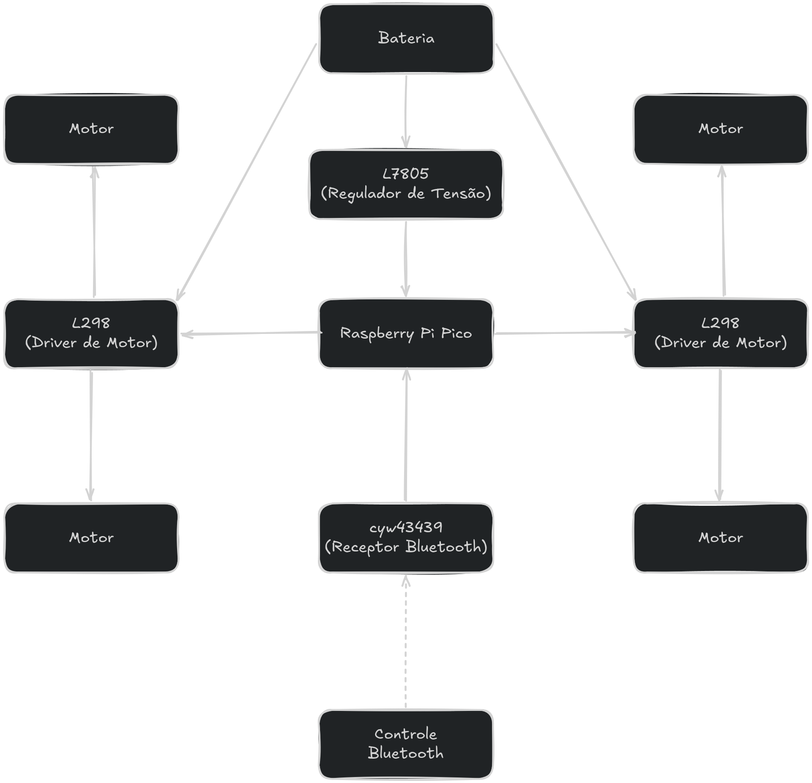
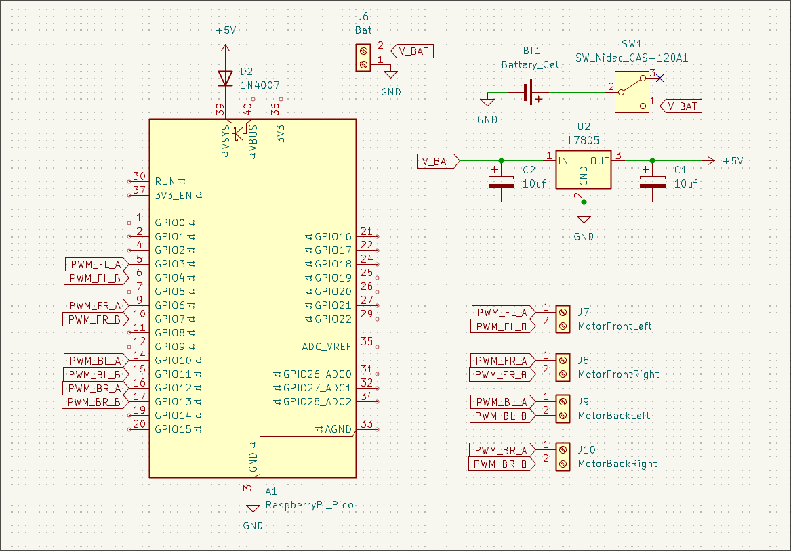

# Descrição

O projeto consiste em um carro radio-controlado. O carro possui rodas omnidirecionais, possibilitando com que o carro consiga se mover para todas as direções. O carro conta com uma bateria interna para alimentar os motores e os microcontroladores. Assim, permitindo com que o carro seja controlado de forma “remota”.

# Requisitos do projeto

| Código | Requisito                                                         | Prioridade  |
| ------ | ----------------------------------------------------------------- | ----------- |
| R01    | Conectar com um dispositivo via Bluetooth                         | Obrigatório |
| R02    | Receber a comunicação do dispositivo conectado                    | Obrigatório |
| R03    | Interpretar os comandos enviados pelo dispositivo                 | Obrigatório |
| R04    | Acionar os motores de acordo com os comandos enviados             | Obrigatório |
| R05    | Utilizar Raspberry Pi como unidade de controle do sistema         | Obrigatório |
| R06    | Alimentação dos motores e microcontrolador devem vir das baterias | Obrigatório |
| R07    | Se comunicar com o controle com baixa latência                    | Desejável   |

# Diagrama de Blocos

# Lista de materiais

| Item                                            | Preço unitário | Quantidade |   Preço total |
| ----------------------------------------------- | -------------: | ---------: | ------------: |
| Módulo Driver Ponte H - L298N                   |       R$ 14,90 |          2 |      R$ 29,80 |
| Raspberry Pi Pico W                             |       R$ 61,90 |          1 |      R$ 61,90 |
| Conector Borne                                  |        R$ 4,90 |          5 |      R$ 24,50 |
| Kit 4 Rodas Omnidirecional Mecanum 80MM Amarela |      R$ 104,58 |          1 |     R$ 104,58 |
| L7805C Regulador de Tensão 5V                   |        R$ 2,90 |          1 |       R$ 2,90 |
| Diodo Retificador 1N4007 (10 unidades)          |        R$ 1,40 |          1 |       R$ 1,40 |
| Motor DC 3-6V com Caixa de Redução e Eixo Duplo |        R$ 7,90 |          4 |      R$ 31,60 |
| Suporte para 2 Baterias Li-Ion 18650            |       R$ 10,50 |          1 |      R$ 10,50 |
| Bateria Li-Ion 18650 3,7V 2550mAh               |       R$ 39,90 |          2 |      R$ 79,80 |
| **Total**                                       |                |            | **R$ 346,98** |

# Montagem

Abaixo temos o esquemático elétrico do sistema, desenvolvido para integrar o microcontrolador Raspberry Pi Pico W aos módulos de potência e controle periférico. O circuito detalha o estágio de regulação de tensão, o barramento de entrada da bateria com chaveamento de segurança, e o mapeamento dos pinos de GPIO configurados para o envio dos sinais PWM. As saídas de controle estão direcionadas para conectores do tipo borne.

# Manual de utilização

## Inicialização

Para garantir a comunicação segura entre o sistema de controle e o carrinho, siga os passos abaixo:

1. Ligar o Controle Bluetooth: Ative o controle físico ou o aplicativo emissor de sinal e coloque-o em modo de pareamento.
2. Ligar o Carrinho: Acione a chave geral (SW1) do protótipo para alimentar a lógica da Raspberry Pi Pico W e os drivers de potência.
3. Aguardar o Pareamento: O chip integrado CYW43439 da Pico W buscará automaticamente o sinal do controle.
4. Confirmação: Aguarde a indicação visual do controle confirmando que a conexão Bluetooth foi concluída com sucesso.

## Instruções de pilotagem

O controle do veículo é distribuído de forma intuitiva através de dois joysticks analógicos:

Joystick Esquerdo (Controle de Direção):

- Responsável por guiar o deslocamento do carrinho no espaço.
- Movimentar para frente ou para trás faz o carrinho se mover em linha reta na respectiva direção.
- Movimentar para os lados (esquerda/direita) faz o carrinho realizar curvas suaves enquanto se desloca.

Joystick Direito (Controle de Rotação):

- Responsável pelo giro sobre o próprio eixo do carrinho.
- Movimentar para a esquerda faz as rodas de um lado girarem em sentido inverso às do outro lado, rotacionando o veículo rapidamente para a esquerda sem sair do lugar.
- Movimentar para a direita realiza a mesma rotação rápida para o sentido horário.
